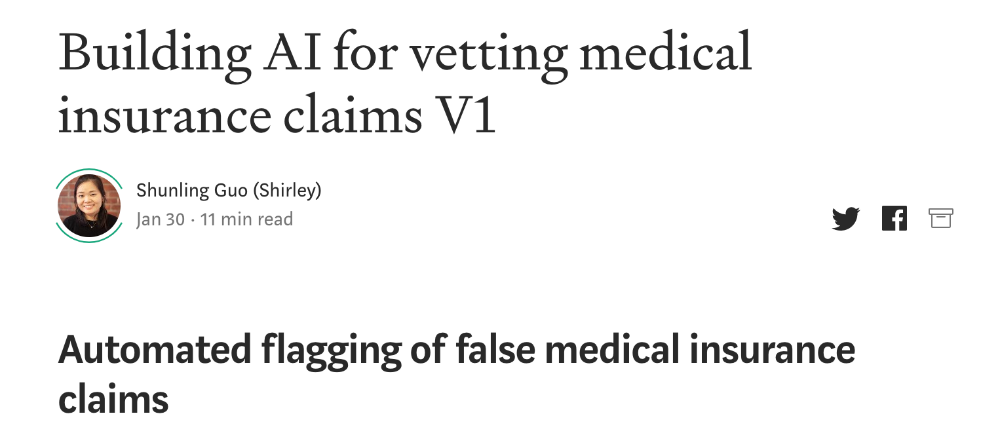

# Insight_HealthDataScience
## Automated flagging of false medical insurance claims 

***
### Motivation
#### Consulting project for Curacel Systems

False claim is a universal problem for all insurance companies, with health insurance dominants the market ([Healthcare Fraud Abuse review](https://github.com/Shunling/CapstoneProjects/blob/master/NaturalLanguageProcessingGPCR/DataCollection.ipynb)). This project is to demonstrate a proof of concept solution to Build AI for vetting medical insurance claims.

### Jupyter notebooks

[DataWangling.ipynb](https://github.com/Shunling/Insight_HealthDataScience/blob/master/Projects/P3/DataWangling.ipynb) Convert data from mySQL database to pandas dataframe. Check data range, abnormality, and missing values. Join table for Exploratory Data Analysis (EDA).

[EDA.ipynb](https://github.com/Shunling/Insight_HealthDataScience/blob/master/Projects/P3/EDA.ipynb) Further check and clean data. Initial exploratory data analysis without dropping unprocessed data, and further clean data.

[EDA_2.ipynb](https://github.com/Shunling/Insight_HealthDataScience/blob/master/Projects/P3/EDA_2.ipynb) Detailed EDA with feature correlations and distributions with clean data. 

[LightGBM_with_Feature_engineering.ipynb](https://github.com/Shunling/Insight_HealthDataScience/blob/master/Projects/P3/LightGBM_with_Feature_engineering.ipynb) Feature engineering with detailed model selection and tuning.

### Detailed story please check the [Medium Post](https://medium.com/curacel/spot-a-bug-f7278bb69f2b)

